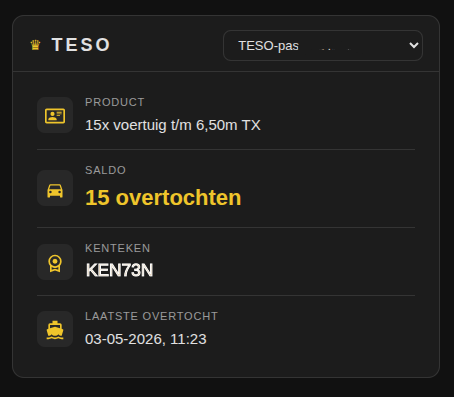
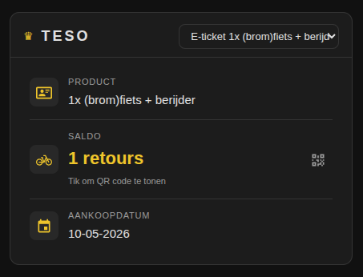
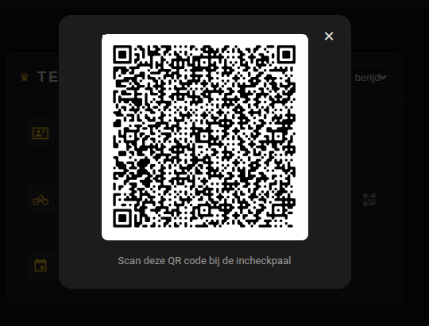

# TESO Veerboot Card

Een custom Lovelace kaart voor Home Assistant die informatie toont van de [TESO Veerboot integratie](https://github.com/nielsbooij/ha-teso). De kaart toont je TESO-passen en e-tickets in één overzicht, met een ingebouwde QR code popup voor e-tickets.

## Vereisten

- Home Assistant 2026.3 of hoger
- [TESO Veerboot integratie](https://github.com/nielsbooij/ha-teso) geïnstalleerd en geconfigureerd
- HACS

## Functies

- Dropdown om te wisselen tussen meerdere TESO-passen en e-tickets
- Per pas: productnaam, saldo, kenteken (indien gekoppeld) en datum laatste overtocht
- Per e-ticket: productnaam, saldo en aankoopdatum
- Tik op het saldo van een e-ticket om de QR code te tonen
- Icoon past automatisch aan op het producttype (auto, fiets, voetganger, vrachtwagen)
- Kleurt mee met het Home Assistant thema

## Schermafbeeldingen

### TESO-pas


### E-ticket


### QR code popup


## Installatie via HACS

1. Ga in HACS naar **Frontend**
2. Klik op de drie puntjes rechtsboven → **Aangepaste repositories**
3. Voeg toe: `https://github.com/nielsbooij/ha-teso-card` met categorie **Lovelace**
4. Zoek naar **TESO Veerboot Card** en installeer
5. Ga naar **Instellingen → Dashboards → (drie puntjes) → Bronnen**
6. Voeg toe: `/hacsfiles/ha-teso-card/teso-card.js` als **JavaScript module**
7. Herstart Home Assistant

## Handmatige installatie

1. Download `teso-card.js` uit deze repository
2. Plaats het bestand in `/config/www/teso-card.js`
3. Ga naar **Instellingen → Dashboards → (drie puntjes) → Bronnen**
4. Voeg toe: `/local/teso-card.js` als **JavaScript module**
5. Herstart Home Assistant

## Gebruik

Voeg de kaart toe aan je dashboard via de kaarteditor of via YAML:

```yaml
type: custom:teso-card
```

De kaart detecteert automatisch alle TESO-passen en e-tickets die door de integratie zijn aangemaakt. Er is geen verdere configuratie nodig.

## Gerelateerd

- [TESO Veerboot integratie](https://github.com/nielsbooij/ha-teso) — de integratie die de data ophaalt
